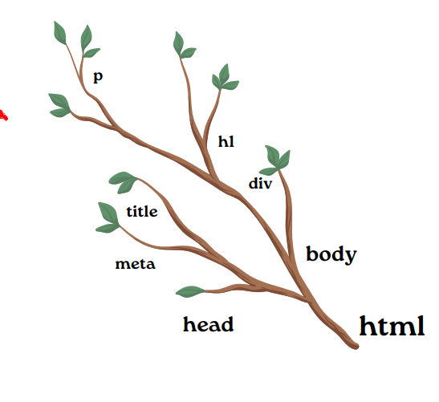
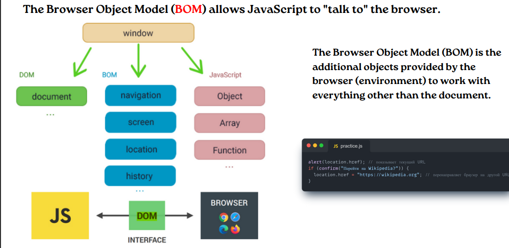
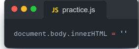

# DOM
# DOM это объектная модель документа, которую браузер создает в памяти компьютера на основании HTML-кода, полученного им от сервера. Иными словами, это представление HTML-документа в виде дерева тегов. DOM обеспечивает представление документа в виде структурированной группы узлов и объектов, которые имеют свойства и методы 

# BOM позволяет JavaScript взаимодействовать с браузером и управлять различными аспектами веб-приложений. Это мощный инструмент для создания интерактивных веб-сайтов и приложений
# alert
# Команда alert() в JavaScript используется для отображения всплывающего окна с сообщением и кнопкой “OK”. Это полезно, когда вы хотите передать информацию пользователю

# Метод querySelector  - возвращает первый дочерний элемент, который соответствует указанному селектору(ам) CSS элемента. Метод запроса Selector All можно использовать для доступа ко всем элементам, которые соответствуют указанному селектору CSS
#  innerHTML  - это свойство полностью обеспечивает простой способ заменить элементарный элемент. Например, все требования тело элемента можно удалить

#  onclick  - Событие onclick в JavaScript активируется, когда пользователь кликает на определенный элемент страницы, такой как кнопка, ссылка, изображение или любой другой элемент, на который можно нажать
# BOM
# BOM Script представляет собой набор объектов, предоставляемых браузерной средой. Он позволяет JavaScript взаимодействовать с самим браузером, обрабатывать свойства окна и управлять взаимодействием с пользователем
# Вот некоторые ключевые компоненты BOM
# 1 Объект window: Это корневой объект BOM, представляющий окно браузера. Он служит глобальным объектом для JavaScript в среде веб-браузера 
# 2- Объект document: Хотя он также является частью DOM, он относится и к BOM. Объект document представляет веб-страницу и предоставляет методы для работы с её содержимым 

# 3 Объект navigator: Предоставляет информацию о браузере, такую как его название, версия и платформа 
# 4- Объект history: Позволяет манипулировать историей сессии браузера, управляя навигацией в пределах сессииа 
# 5- Объект screen: Предоставляет информацию об экране пользователя, такую как его ширина, высота и глубина цвета.а 